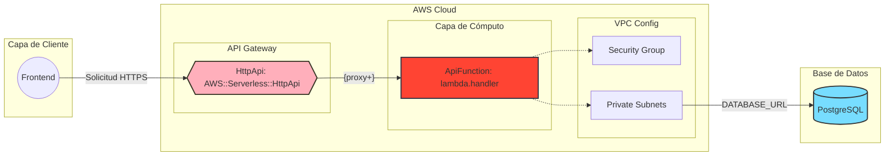

# backend-foodoffice

Backend para FoodOffice construido con Node.js, TypeScript, Express, tRPC y AWS Lambda.

## 🏗️ Arquitectura

El backend está desplegado en AWS usando una arquitectura serverless con Lambda y API Gateway, conectándose a RDS PostgreSQL dentro de una VPC privada.



### Componentes Principales

- **API Gateway (HttpApi)**: Punto de entrada HTTPS que enruta todas las solicitudes al handler de Lambda
- **Lambda Function (ApiFunction)**: Función serverless que ejecuta el código del backend (Express + tRPC)
- **VPC Configuration**: Lambda desplegada en subnets privadas con Security Groups para acceso seguro a RDS
- **RDS PostgreSQL**: Base de datos relacional en subnets privadas de datos

### Flujo de Solicitudes

1. El frontend envía solicitudes HTTPS a API Gateway
2. API Gateway enruta las solicitudes al handler de Lambda usando el patrón `{proxy+}`
3. Lambda procesa la solicitud (Express + tRPC)
4. Si requiere acceso a datos, Lambda se conecta a RDS a través de la VPC privada
5. La respuesta se devuelve al frontend a través de API Gateway

---

### Etapas del Pipeline

#### 1. **Build y Despliegue**
- Instalación de dependencias Node.js
- Compilación de TypeScript
- Build con AWS SAM CLI
- Despliegue a AWS Lambda + API Gateway

#### 2. **Verificación de Security Groups**
El pipeline verifica y configura automáticamente:
- ✅ **Lambda Security Group (Egress)**: Permite tráfico saliente al puerto 5432 hacia RDS
- ✅ **RDS Security Group (Ingress)**: Permite tráfico entrante desde Lambda en puerto 5432

Si los Security Groups no están configurados, el pipeline intenta configurarlos automáticamente o muestra los comandos exactos para hacerlo manualmente.

#### 3. **Diagnóstico de Lambda**
Verifica:
- Configuración de VPC (Security Groups, Subnets, VPC ID)
- Variables de entorno (especialmente `DATABASE_URL`)
- Logs recientes de CloudWatch para detectar errores

#### 4. **Verificación de Conexión a Base de Datos**
- Prueba la conexión usando el endpoint `/api/db-check`
- Reintenta hasta 5 veces con esperas de 10 segundos entre intentos
- Verifica que las tablas existan en la base de datos
- Muestra troubleshooting detallado si falla

#### 5. **Ejecución de Migraciones**
- Ejecuta `npm run db:push` para aplicar el schema de Drizzle
- Verifica nuevamente la conexión después de las migraciones
- Confirma que las tablas estén disponibles

### Validaciones Incluidas

El pipeline incluye validaciones automáticas que aseguran:

| Validación | Descripción | Acción si falla |
|------------|-------------|-----------------|
| **Security Groups** | Verifica reglas de tráfico entre Lambda y RDS | Intenta configurar automáticamente o muestra comandos |
| **Conexión a BD** | Prueba conectividad usando `/api/db-check` | Reintenta 5 veces, luego falla con diagnóstico |
| **Migraciones** | Verifica que las tablas existan | Falla si las migraciones no se aplican correctamente |

### Comportamiento del Pipeline

- ✅ **Si Security Groups fallan**: El pipeline **falla** y muestra cómo corregirlo
- ✅ **Si la conexión falla**: El pipeline **falla** después de 5 intentos con diagnóstico completo
- ✅ **Si las migraciones fallan**: El pipeline **falla** y muestra el error

Esto asegura que solo se despliegue código que pueda conectarse correctamente a la base de datos.

### Troubleshooting Automático

El pipeline incluye diagnóstico automático que verifica:
1. Configuración de VPC de Lambda (Security Groups, Subnets, VPC ID)
2. Variables de entorno (DATABASE_URL)
3. Logs de CloudWatch para errores recientes
4. Verificación de que Lambda y RDS estén en el mismo VPC
5. Reglas de Security Groups (Egress e Ingress)

Para más detalles sobre las validaciones, consulta [VALIDACIONES_PIPELINE.md](VALIDACIONES_PIPELINE.md).

---

## 🚀 Despliegue con GitHub Actions

El proyecto incluye un workflow de GitHub Actions que automatiza el despliegue a AWS cuando se hace push a las ramas `main` o `master`.

### Configuración de Secrets

Para que el workflow funcione correctamente, necesitas configurar los siguientes secrets en tu repositorio de GitHub:

**Configuración → Secrets and variables → Actions → New repository secret**

#### Secrets de AWS:
- `AWS_ACCESS_KEY_ID`: Tu Access Key ID de AWS
- `AWS_SECRET_ACCESS_KEY`: Tu Secret Access Key de AWS

#### Secrets de la aplicación:
- `DATABASE_HOST`: Endpoint de tu base de datos RDS (ej: `foodoffice-db.xxxxx.us-east-1.rds.amazonaws.com`)
- `DATABASE_NAME`: Nombre de la base de datos (ej: `foodoffice`)
- `DATABASE_USER`: Usuario de la base de datos (ej: `foodoffice`)
- `DATABASE_PASSWORD`: Contraseña de la base de datos
- `JWT_SECRET`: Secret para firmar los tokens JWT
- `SUBNET_IDS`: IDs de las subnets separadas por comas (ej: `subnet-xxxxx,subnet-yyyyy`)
- `SECURITY_GROUP_ID`: ID del Security Group para Lambda (ej: `sg-xxxxx`)
- `RDS_SECURITY_GROUP_ID`: ID del Security Group para RDS (ej: `sg-xxxxx`) - **Opcional**: Si no se configura, se saltará la verificación de Security Groups
- `ALLOWED_ORIGINS`: Orígenes permitidos para CORS separados por comas (ej: `https://tu-dominio.com,http://localhost:5173`)
- `OAUTH_SERVER_URL`: URL del servidor OAuth (ej: `https://tu-dominio.auth0.com`)
- `VITE_APP_ID`: ID de la aplicación OAuth
- `OAUTH_CLIENT_SECRET`: Secret del cliente OAuth
- `OWNER_OPEN_ID`: OpenID del propietario/administrador (ej: `auth0|xxxxx`)

### Cómo funciona el workflow

1. **Job de Test**: Se ejecuta en cada push y pull request
   - Instala dependencias
   - Ejecuta tests
   - Verifica tipos TypeScript
   - Construye el proyecto

2. **Job de Deploy**: Se ejecuta solo en push a `main`/`master`
   - Construye el proyecto
   - Instala AWS SAM CLI
   - Despliega a AWS usando SAM
   - **Verifica Security Groups**: Valida que Lambda y RDS tengan las reglas correctas configuradas
   - **Verifica conexión a BD**: Prueba la conexión usando el endpoint `/api/db-check`
   - Ejecuta migraciones de base de datos
   - Verifica nuevamente la conexión después de las migraciones
   - Muestra la URL de la API desplegada
   
   ⚠️ **Importante**: El pipeline fallará si:
   - Los Security Groups no están configurados correctamente
   - La conexión a la base de datos no funciona
   - Las migraciones fallan

### Despliegue manual

Si prefieres desplegar manualmente, puedes usar el script incluido:

O seguir los pasos manualmente:

```bash
npm run build
sam build
sam deploy --parameter-overrides-file sam-parameters.json
```